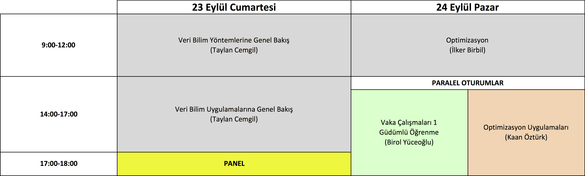
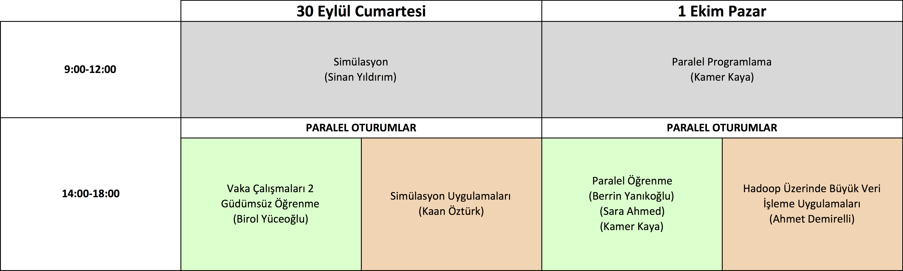

# Veri Bilim - Yapay Öğrenme Yaz Okulu, 2017 "Matematiksel Temeller ve Vaka Çalışmaları"

Uygulama derslerinde ağırlıklı olarak Python 3.6 programlama dili kullanılacaktır. Dersler için gerekli olan paketleri de içeren [Anaconda](https://www.anaconda.com/download/) dağıtımını bilgisayarınıza kurup gelmeniz yeterli olacaktır.

Program detayları aşağıda verilmiştir.

## Program

### Veri Bilim Yöntemlerine ve Uygulamalarına Genel Bakış (Taylan Cemgil)

1. Giriş ve tarihçe, yapay zeka, makine öğrenmesi, veri madenciliği
2. Güdümlü ve güdümsüz öğrenme
3. Regresyon, yapay sinir ağları
4. Bayesci istatistik ve olasılık modelleri
5. Bayesci çıkarım
6. Uygulama alanlarından örnekler
7. Veri analizine model tabanlı ve algoritma tabanlı yaklaşımlar

### Optimizasyon (İlker Birbil)

1. Genel çerçeve ve modelleme
2. Doğrusal ve tamsayılı programlama ve örnekler
3. Doğrusal olmayan programlama
4. Yapay öğrenme problemlerinde çözüm yöntemleri

### Vaka Çalışmaları 1 - Güdümlü Öğrenme (Birol Yüceoğlu)
1. Kredi risk tahmini
  * Verinin temizlenmesi
  * Öznitelik türetme
  * Tahmin modellerinin uygulanması
  * Parametrelerin belirlenmesi
2. Google Street View fotoğraflarından karakter tanıma
  * Veri kümelerinin oluşturulması
  * Tahmin modellerinin uygulanması
  * Veri kümesinin zenginleştirilmesi

### Optimizasyon Uygulamaları (Kaan Öztürk)

1. En dik iniş, Newton, ve sahte-Newton algoritmaları
2. Stokastik dik iniş, mini yığın algoritmaları.
3. Çeşitli optimizasyon algoritmalarıyla el yazısı rakam tanıma.
4. Scipy ile optimizasyon.

### Simülasyon (Sinan Yıldırım)

1. Temel örnekleme yöntemleri
2. Önem örneklemesi
3. Markov zinciri Monte Carlo
4. Bayesci çıkarım uygulamaları

### Vaka Çalışmaları 2 - Güdümsüz öğrenme (Birol Yüceoğlu)

1. Perakendede müşteri segmentasyonu
  * Veri kümesinin temizlenmesi
  * K-ortalamalar yöntemiyle segmentlerin belirlenmesi
  * Sonuçların değerlendirilmesi
2. MINST veri kümesi ile güdümsüz öğrenme

### Simülasyon Uygulamaları (Kaan Öztürk)

1. PyMC3 ile Bayesci olasılık modelleri
2. Bir dağılımın parametrelerini kestirme
3. Doğrusal regresyon ve lojistik regresyon için parametre kestirimi
4. Değişim noktası modelleri
5. Saklı Markov modelleri

### Paralel Programlama (Kamer Kaya)

1. Paralel ve dağıtık hesaplamanın temelleri
2. OpenMP ile çok çekirdekli işlemciler üzerinde paralel hesaplamaya giriş
3. CUDA ile GPU tabanlı paralel hesaplamaya giriş
4. Python ile paralel hesaplamaya giriş

### Paralel Öğrenme (Berrin Yanıkoğlu, Sara Ahmed, Kamer Kaya)

1. Python ile paralel makine öğrenmesi
2. Derin öğrenme

### Hadoop Üzerinde Büyük Veri İşleme Uygulamaları (Ahmet Demirelli)

1. Büyük veri depolama ve Hadoop
2. Hadoop yapısı ve bileşenleri
3. Hadoop komutları, Pig ve Hive kullanımı
4. Apache Spark işlerini Hadoop üzerinde çalıştırma
5. Spark ile RDD ve DataFrame yapıları
6. Spark ile veri dönüşümü işlemleri (Transformation ve Action  metodları)
7. Apache Spark ML (Machine Learning) kütüphanesi



## Dersleri Verenler

### Sara Ahmed

Sara Ahmed, lisans derecesini 2011'de Mısır'ın Ain Shams Üniversitesi'nden, yüksek lisans derecesini 2014 yılında Nil Üniversitesi'nden almıştır. Şu anda Sabancı Üniversitesi'nde derin öğrenme ve nitelik temelli sınıflandırma üzerine doktora çalışmalarını sürdürmektedir.

### İlker Birbil

İlker Birbil, doktora çalışmasını 2002 yılında North Carolina State Üniversitesi’nde Endüstri Mühendisliği ana dalı ile Yöneylem Araştırması ve Matematik yan dallarında tamamlamıştır. 2002 - 2004 yılları arasında Erasmus Yönetim Araştırma Enstitüsü’nde (Hollanda) doktora sonrası araştırma bursu ile çalışmalarını sürdüren İlker Birbil, 2004 yılından bugüne dek Sabancı Üniversitesi’nde öğretim üyesi olarak görev almaktadır. Matematiksel programlama alanında algoritma tasarımı genel başlığı altında toplanabilecek kuramsal ve uygulamalı pek çok çalışması vardır.

### Ali Taylan Cemgil

Taylan Cemgil, Boğaziçi Üniversitesi bilgisayar mühendisliği bölümünde lisans ve yüksek lisans çalışmalarının ardından, yapay öğrenme konusundaki doktora çalışmalarını Hollanda, Nijmegen Radboud Universitesinde tamamladı. 2004 ve 2008 arasında doktora sonrası araştırmacı olarak sırasıyla Amsterdam ve Cambridge Üniversitelerinde çalıştı. 2008'den beri Boğaziçi Üniversitesi Bilgisayar mühendisliği bölümünde öğretim görevlisi olarak görev yapmaktadır. İlgi duyduğu araştırma alanları arasında Büyük verilerin analizi, Bayesci istatistiksel metotlar, yaklaşık çıkarım, yapay öğrenme konuları sayılabilir. Sanayi projelerinde veri analizi konularında danışmanlık çalışmalarının yanı sıra, Boğaziçi üniversitesinde konu ile ilgili yüksek lisans dersleri vermektedir.

### Ahmet Demirelli

Ahmet Demirelli, 2002 yılı Marmara Üniversitesi Matematik Öğretmenliği ve 2004 yılında Sabancı Üniversitesi Bilgi Teknolojileri Yüksek Lisans programından mezun oldu. 2003-2005 yılları arasına Sabancı Üniversitesi Mühendislik ve Doğa Bilimleri fakültesinde eğitim asistanı olarak görev yaptı. 2005 yılından bu yana Sabancı Üniversitesi BT yüksek lisans programında Java, kurumsal uygulama mimarileri, Linux sistem yönetimi ve mobil programlama dersleri vermektedir. BT yüksek lisans derslerinin yanında Veri Analitiği yüksek lisans programında Hadoop ile büyük veri işleme dersi vermektedir. İlgi alanları arasında büyük verilerin paralel olarak işlenmesi ve makine öğrenmesi uygulamaları sayılabilir.

### Kamer Kaya

Kamer Kaya, doktorasını 2009 yılında Bilkent Üniversitesi Bilgisayar Mühendisliği bölümünden almıştır. Daha sonra Fransa'daki CERFACS Araştırma Merkezi'nde Parallel Algoritmalar projesinde çalışmalarını sürdürmüş, 2011 yılında Ohio Eyalet Üniversitesi'ne doktora sonrası araştırma görevlisi olarak katılmıştır. 2012 yılında aynı üniversitede Yardımcı Doçent olarak çalışmaya başlayan Dr. Kaya, 2014 yılından beri Sabancı Üniversitesi'nde öğretim üyesi olarak görev almaktadır. Yüksek başarımlı hesaplama, paralel algoritmalar ve kriptografi alanlarında birçok çalışması bulunmaktadır.

### Kaan Öztürk

Kaan Öztürk, fizik lisans ve yüksek lisans derecelerini Boğaziçi Üniversitesi'nden, fizik doktora derecesini Rice Üniversitesi'nden aldı. Işık ve Yeditepe üniversitelerinin bilişim bölümlerinde öğretim üyesi olarak görev yaptı. 2015-2016 döneminde TÜBİTAK desteğiyle Rice Üniversitesi'nde ziyaretçi araştırmacı, 2016-2017 döneminde ise Sabancı Üniversitesi'nde doktoraüstü araştırmacı olarak çalıştı. Yapay öğrenme uygulamaları, hesaplamalı fizik, karmaşık sistemler konularıyla ilgileniyor.

### Berrin Yanıkoğlu

Berrin Yanıkoğlu, 1988 yılında Boğaziçi Üniversitesi Bilgisayar Bilimleri ve Matematik Bölümlerinden lisans diplomalarını aldı. 1993 yılında, Dartmouth College'de Bilgisayar Bilimleri alanında doktora çalışmalarını tamamladı. 2000 yılından beri Sabancı Üniversitesi Mühendislik ve Doğa Bilimleri Fakültesi’nde öğretim üyesi olarak görev yapmaktadır. Yanıkoğlu'nun araştırma alanları el yazısı tanıma, biyometri (imza, yüz, parmak izi), fotoğraflardan bitki tanıma ve duygu analizi üzerine odaklanarak görüntü anlama ve metin analizlerine uygulanan model tanıma ve makine öğrenimi alanlarındadır. Dr. Yanıkoğlu, öğrencileri ve meslektaşları ile birlikte yaptıkları çalışmalarla çeşitli uluslararası imza doğrulama yarışmalarında birincilik ödülü kazanmıştır.

### Sinan Yıldırım

Sinan Yıldırım, Boğaziçi Üniversitesi Elektrik-Elektronik Mühendisliği Bölümü’nde lisans ve yüksek lisans çalışmalarının ardından, matematiksel istatistik konusundaki doktora çalışmalarını İngiltere, Cambridge Üniversitesi’nde tamamladı. 2013 ve 2015 arasında doktora sonrası araştırmacı olarak İngiltere, Bristol Üniversitesi Matematik Bölümü’nde çalıştı. 2015'ten beri Sabancı Üniversitesi Mühendislik ve Doğa Bilimleri Fakültesi’nde öğretim görevlisi olarak görev yapmaktadır. İlgi duyduğu temel araştırma alanları Bayesci istatistik ve Monte Carlo yöntemleridir.

### Birol Yüceoğlu

Birol Yüceoğlu, lisans ve yüksek lisans eğitimini Sabancı Üniversitesi Endüstri Mühendisliği bölümünde tamamladı. Doktora eğitimini 2015 yılında  Maastricht Üniversitesi'nde Yöneylem Araştırması üzerine yaptı. Halen Migros T.A.Ş. Ar-Ge Merkezi'nde çalışmakta ve Sabancı Üniversitesi Veri Analitiği Tezsiz Yüksek Lisans programında ders vermektedir. Araştırma alanları veri analizi uygulamaları, çizge teorisi ve tamsayı programlamadır.
